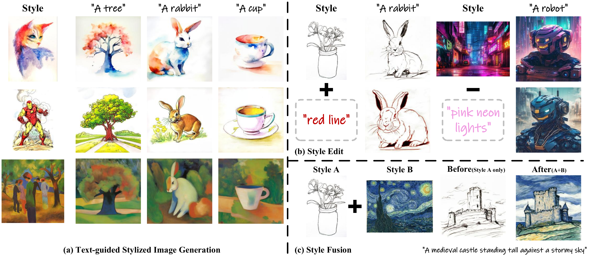

# StyleDistillation

**StyleDistillation: A New Insight of Image Style Enables Personalized Aesthetic Manipulation**  
Yuxin Wang, Xiaoyu Geng, Yuke Li, Zheng Wang  
ICML 2026



## Abstract

Text-guided stylized image generation has yielded promising advances by leveraging the powerful capabilities of text-to-image diffusion models. However, the inherent coupling of style and content information within the reference image presents a significant challenge. To address this, we propose StyleDistillation, a novel approach grounded in two key observations about the CLIP embedding space from a style perspective. By leveraging a lightweight StyleDistiller module, combined with carefully designed optimization objectives based on geometric and semantic priors, we can extract fine-grained style representation from the reference image. Additionally, we introduce a Prompt Alignment Enhancement mechanism during inference, which significantly improves the control that text prompts exert over the generated images. Extensive experiments demonstrate that our method achieves outstanding performance in both style reproduction and prompt alignment. Furthermore, StyleDistillation supports various personalized operations, including style editing and style fusion, highlighting its substantial potential for diverse applications.

## Repository structure

```text
StyleDistillation/
├── train.py
├── inference.py
├── metric.py
├── module/
│   ├── distiller.py
│   ├── style_adapter.py
│   └── attn_processor.py
├── util/
│   ├── dataset.py
│   └── utils.py
├── example/
│   ├── 1/
│   ├── 2/
│   └── 3/
├── asset/
│   └── intro.png
└── environment/
```

## Environment (Linux x86_64)

```bash
conda create --name style-distillation --file environment/conda-linux-64.explicit.txt
conda activate style-distillation

python -m pip install --index-url https://pypi.org/simple --no-build-isolation \
  -c environment/constraints.py38.txt \
  -r environment/requirements.txt

python -m pip check
```

## Pretrained models

Download weights from their upstream providers; model weights are not bundled in this repository. Review and comply with each provider's license and access conditions. The `hf` download command is provided by the installed Hugging Face Hub package.

### Training and inference

| Component | Upstream source | Local path used below |
| --- | --- | --- |
| SDXL base | [Stable Diffusion XL Base 1.0](https://huggingface.co/stabilityai/stable-diffusion-xl-base-1.0) | `models/SDXL` |
| FP16-compatible VAE | [SDXL VAE FP16 Fix](https://huggingface.co/madebyollin/sdxl-vae-fp16-fix) | `models/sdxl-vae-fp16-fix` |
| Image encoder | [IP-Adapter SDXL image encoder](https://huggingface.co/h94/IP-Adapter/tree/main/sdxl_models/image_encoder) | `models/IP-Adapter/sdxl_models/image_encoder` |
| Adapter | [IP-Adapter](https://huggingface.co/h94/IP-Adapter) | `models/IP-Adapter/sdxl_models/ip-adapter_sdxl.bin` |

```bash
hf download stabilityai/stable-diffusion-xl-base-1.0 \
  --include "model_index.json" "scheduler/*" "tokenizer/*" "tokenizer_2/*" \
  "text_encoder/config.json" "text_encoder/model.safetensors" \
  "text_encoder_2/config.json" "text_encoder_2/model.safetensors" \
  "unet/config.json" "unet/diffusion_pytorch_model.safetensors" \
  --local-dir models/SDXL

hf download madebyollin/sdxl-vae-fp16-fix \
  config.json diffusion_pytorch_model.safetensors \
  --local-dir models/sdxl-vae-fp16-fix

hf download h94/IP-Adapter \
  sdxl_models/ip-adapter_sdxl.bin \
  sdxl_models/image_encoder/config.json \
  sdxl_models/image_encoder/model.safetensors \
  --local-dir models/IP-Adapter
```

The SDXL Refiner and SDXL's bundled VAE are not needed; the scripts load the separate VAE above. You can reuse existing local model directories by updating the corresponding command-line paths.

### Evaluation only

Skip these downloads if you do not plan to run `metric.py`. Evaluation requires OpenAI CLIP ViT-B/32, OpenAI CLIP ViT-L/14, and the CSD ViT-L checkpoint.

The CLIP URLs below come from the [official OpenAI CLIP model registry](https://github.com/openai/CLIP/blob/dcba3cb2e2827b402d2701e7e1c7d9fed8a20ef1/clip/clip.py). The CSD checkpoint is available from the [authors' Hugging Face repository](https://huggingface.co/tomg-group-umd/CSD-ViT-L).

```bash
mkdir -p models/CLIP

curl --fail --location \
  --output models/CLIP/ViT-B-32.pt \
  https://openaipublic.azureedge.net/clip/models/40d365715913c9da98579312b702a82c18be219cc2a73407c4526f58eba950af/ViT-B-32.pt

curl --fail --location \
  --output models/CLIP/ViT-L-14.pt \
  https://openaipublic.azureedge.net/clip/models/b8cca3fd41ae0c99ba7e8951adf17d267cdb84cd88be6f7c2e0eca1737a03836/ViT-L-14.pt

hf download tomg-group-umd/CSD-ViT-L pytorch_model.bin \
  --local-dir models/CSD
```

## Train a StyleDistiller

Each example contains a reference image, a description of its content, and a description of its style. The training arguments `--content_ref` and `--style_ref` accept **text**, not paths to text files.

The following example reads the supplied descriptions and trains on `example/1/1.jpg`:

```bash
CONTENT_REF="$(python -c "from pathlib import Path; print(Path('example/1/content.txt').read_text(encoding='utf-8-sig').strip())")"
STYLE_REF="$(python -c "from pathlib import Path; print(Path('example/1/style.txt').read_text(encoding='utf-8-sig').strip())")"

python train.py \
  --pretrained_model_name_or_path models/SDXL \
  --vae_path models/sdxl-vae-fp16-fix \
  --image_encoder_path models/IP-Adapter/sdxl_models/image_encoder \
  --ip_ckpt models/IP-Adapter/sdxl_models/ip-adapter_sdxl.bin \
  --train_img_path example/1/1.jpg \
  --content_ref "$CONTENT_REF" \
  --style_ref "$STYLE_REF" \
  --output_dir outputs/example1/style \
  --max_train_steps 300 \
  --train_batch_size 4 \
  --learning_rate 1e-4 \
  --resolution 512 \
  --mixed_precision fp16 \
  --seed 42
```

## Generate images

After training, generate images with the prompt `a tree`:

```bash
python inference.py \
  --pretrained_model_name_or_path models/SDXL \
  --vae_path models/sdxl-vae-fp16-fix \
  --image_encoder_path models/IP-Adapter/sdxl_models/image_encoder \
  --ip_ckpt models/IP-Adapter/sdxl_models/ip-adapter_sdxl.bin \
  --style_path outputs/example1/style \
  --save_root outputs/example1/images \
  --prompt "a tree" \
  --num_samples 5 \
  --add_content_scale 0.35
```

## Evaluate one image

The metric script compares one generated image with its generation prompt for CLIPText, and with the reference image for CSD:

```bash
python metric.py \
  --image_path outputs/example1/images/0_0.jpg \
  --reference_image_path example/1/1.jpg \
  --prompt "a tree" \
  --clip_model_path models/CLIP/ViT-B-32.pt \
  --csd_clip_model_path models/CLIP/ViT-L-14.pt \
  --csd_checkpoint_path models/CSD/pytorch_model.bin \
  --device cuda:0
```

## Citation

```bibtex
@inproceedings{wang2026styledistillation,
  title={StyleDistillation: A New Insight of Image Style Enables Personalized Aesthetic Manipulation},
  author={Wang, Yuxin and Geng, Xiaoyu and Li, Yuke and Wang, Zheng},
  booktitle={Proceedings of the 43rd International Conference on Machine Learning},
  year={2026}
}
```

## Acknowledgments

This implementation builds on [Stable Diffusion XL](https://huggingface.co/stabilityai/stable-diffusion-xl-base-1.0), [Diffusers](https://github.com/huggingface/diffusers), [IP-Adapter](https://github.com/tencent-ailab/IP-Adapter), [OpenAI CLIP](https://github.com/openai/CLIP), and [CSD](https://github.com/learn2phoenix/CSD). Upstream code and model weights remain subject to their respective licenses.
